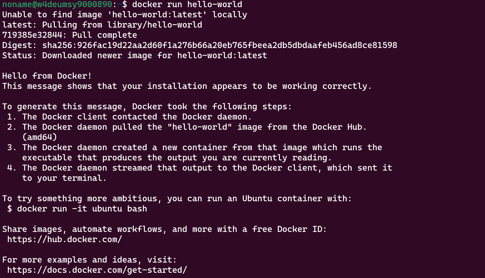
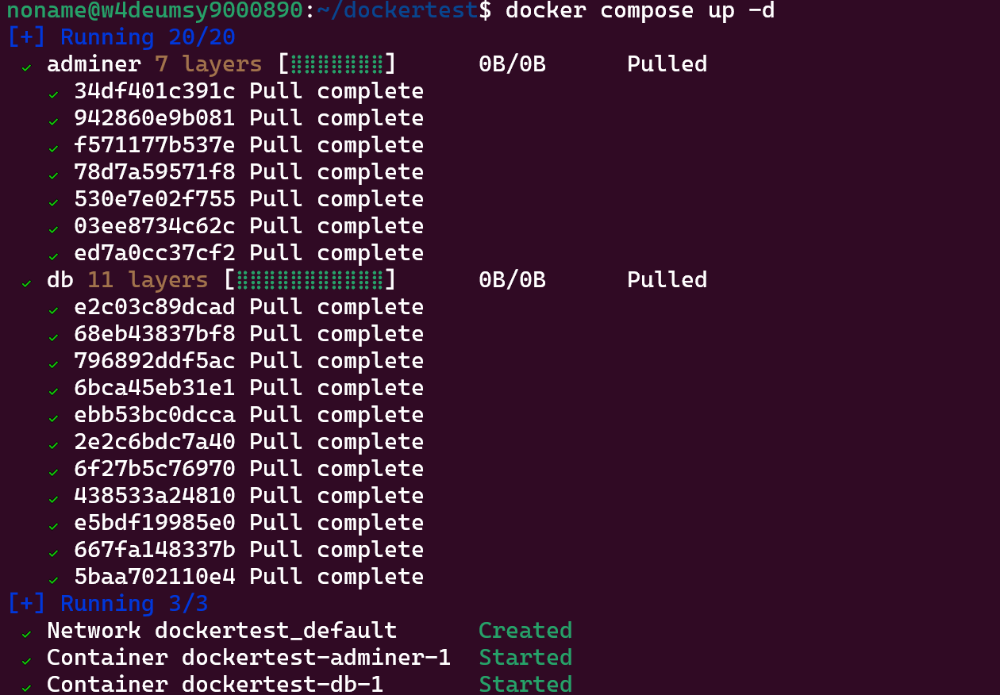
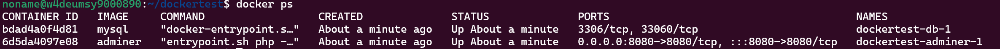

# Docker

**Docker** is a set of platform as a service (PaaS) products that use OS-level virtualization to deliver software in packages called _containers_. The service has both free and premium tiers. The software that hosts the containers is called **Docker Engine**.

Project Homepage: [Home - Docker](https://www.docker.com/)
Documentation: [Docker Documentation](https://docs.docker.com/)
Installation: [Docker Installation](https://docs.docker.com/engine/install/)
Images: [Docker Images](https://hub.docker.com)

---

## Installation

One click installation script:

```sh
curl -fsSL https://get.docker.com -o get-docker.sh
sudo sh get-docker.sh
```

## Ubuntu

Run Command to uninstall conflicting packages:

```sh
for pkg in docker.io docker-doc docker-compose podman-docker containerd runc; do sudo apt-get remove $pkg; done
```

update:

````sh
 sudo apt update && sudo apt upgrade -y
````

Add Docker’s official GPG key:

```sh
sudo install -m 0755 -d /etc/apt/keyrings
curl -fsSL https://download.docker.com/linux/ubuntu/gpg | sudo gpg --dearmor -o /etc/apt/keyrings/docker.gpg
sudo chmod a+r /etc/apt/keyrings/docker.gpg
```

Setup Repo

```sh
echo \
  "deb [arch="$(dpkg --print-architecture)" signed-by=/etc/apt/keyrings/docker.gpg] https://download.docker.com/linux/ubuntu \
  "$(. /etc/os-release && echo "$VERSION_CODENAME")" stable" | \
  sudo tee /etc/apt/sources.list.d/docker.list > /dev/null
```

## Install Docker Engine

update the apt package index

```sh
sudo apt update
```

install latest version:

```sh
sudo apt-get install docker-ce docker-ce-cli containerd.io docker-buildx-plugin docker-compose-plugin -y
```

check installation

```sh
sudo docker run hello-world
```

Post Installation

Run docker as non root user:

```sh
sudo usermod -aG docker <yourusername>
```

activate changes for the group

```sh
newgrp docker
```

enable docker at reboot

```sh
sudo systemctl enable docker
```

let changes take affect

```sh
sudo systemctl restart docker
```

test if everything works

```sh
docker run hello-world
```

- you should get back something like this:  



- you can also test if the compose plugin is working, just create a simple docker YML File:

create a folder like: dockertest

```sh
mkdir dockertest
```

create .yml file in that folder:

```sh
cd dockertest
```

```sh
touch docker-compose.yml
```

copy my example and paste it in with an editor like nano

example:

- its a little bit specified
- we use the bridge network and custom names for the containers: these lines are optional

- put the following content into the .yml file
- i like to use nano

```sh
sudo nano docker-compose.yml
```

```yml
version: '3.1'

networks:
  my_custom_network:
    driver: bridge
    name: my-custom-network

services:
  db:
    image: mysql
    container_name: dbtest
    restart: always
    environment:
      MYSQL_ROOT_PASSWORD: example
    networks:
      - my_custom_network

  adminer:
    image: adminer
    container_name: adminer
    restart: always
    ports:
      - 8080:8080
    networks:
      - my_custom_network
```

- safe with strg + x

test it:

- you must be in the folder the file is in

```sh
docker compose up -d
```

- you can remove the -d if you want to see what happens inside the containers



you can also check where they are running

```sh
docker ps
```



- to see the graphic interface, go into a browser and type localhost:8080
- you should now see a login page: use your mysql credentials in the yml file to login
- user = root, password = example

remove container and network

```sh
docker compose down
```

now have fun testing your projects with docker :)

---
