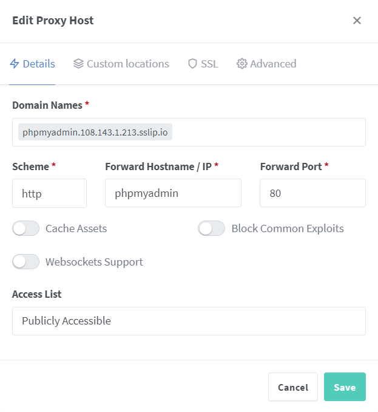

# Installation

## 1. WSL

install wsl (powershell)

```sh
wsl --install
```

set version zu 2

```sh
wsl --set-default-version 2
```

install ubuntu 22.04 with console or use ms store

```sh
wsl --install -d Ubuntu-22.04
```

you can easy list all distros for wsl with:

```sh
wsl --list --online
```

---

## 2. Ubuntu Setup

1. create User + password

2. update all packages + autoremove

```sh
sudo apt update && sudo apt upgrade && sudo apt autoremove
```

Docker Engine

- see my docker install quide:

---

## 3. YML file

preperation:

- i don't expose extern ports for my containers besides the ports i need for my reverse proxy
- i just expose the intern docker port to access these containers

- my yml (please change the default passwords)

```yml
version: '3.8'

services:
# database
  db:
    image: mysql:5.7
    container_name: db
    volumes:
      - db_data_volume:/var/lib/mysql
    restart: unless-stopped
    environment:
      MYSQL_ROOT_PASSWORD: password
      MYSQL_DATABASE: wordpress
      MYSQL_USER: wordpress
      MYSQL_PASSWORD: wordpress
    networks:
      - dockerwp
# overlay for database
  phpmyadmin:
    depends_on:
      - db
    image: phpmyadmin
    container_name: phpmyadmin
    restart: unless-stopped
    #ports:
     # - "8080:80"
    environment:
      PMA_HOST: db
      MYSQL_ROOT_PASSWORD: password
    networks:
      - dockerwp
# website editor 
  wordpress:
    depends_on:
      - db
      - app
    image: wordpress:latest
    container_name: wp
    volumes:
      - wordpress_data_volume:/var/www/html
    #  - ./src:/var/www/html
   # ports:
     # - '8000:80'
    restart: unless-stopped
    environment:
      WORDPRESS_DB_HOST: db
      WORDPRESS_DB_USER: wordpress
      WORDPRESS_DB_PASSWORD: wordpress
      WORDPRESS_DB_NAME: wordpress
    networks:
      - dockerwp
# nginx proxy manager
  app:
    image: 'jc21/nginx-proxy-manager:latest'
    restart: unless-stopped
    ports:
      - '80:80'    # Public HTTP Port
      - '443:443'  # Public HTTPS Port
      - '81:81'    # Admin Web Port
    volumes:
      - ./data:/data
      - ./letsencrypt:/etc/letsencrypt
    networks:
      - dockerwp

# my network
networks:
  dockerwp:
    driver: bridge
    name: proxy
 
volumes:
  db_data_volume: {}
  wordpress_data_volume: {}
```

```sh
docker compose up -d
```

setup

- login into the graphic interface of nginxproxymnager: localhost:81


- default mail: ```admin@example.com```
- default password: changeme
- change password, mail, Full Name, Nickname after logging in

---

adding proxy hosts


- because i have no domain i use .localhost
- Scheme: http
- Hostname: wordpress (hostname of the docker container)
- port: 80 = intern docker port, you wont reach the interface with: localhost:80


- i also did this for my phpmyadmin, and wordpress admin page

---

testing

- it works

phpmyadmin:


wordpress site:


wordpress admin:


## 4. Openssl

- i need this to create my TSL certificates to use https for my custom proxy hosts
- its preinstalled

1. create a folder where you want to safe the certificates

command:

- change .crt name and .key to what u want

 ```sh
openssl req -new -newkey rsa:4096 -x509 -sha256 -days 365 -nodes -out test.crt -keyout test.key
```

### explained

The command you provided is used to generate a self-signed SSL/TLS certificate using OpenSSL. Let's break down the different options and what they do:

- `openssl`: This is the command-line tool for OpenSSL.
- `req`: This specifies that you want to create a new certificate signing request (CSR) or a self-signed certificate.
- `-new`: This flag indicates that you want to generate a new CSR or self-signed certificate.
- `-newkey rsa:4096`: This option specifies that you want to generate a new RSA key pair with a key length of 4096 bits.
- `-x509`: This option indicates that you want to create a self-signed certificate instead of a CSR.
- `-sha256`: This flag specifies the signature hash algorithm to use, in this case, SHA-256.
- `-days 365`: This sets the validity period of the certificate in days. In this example, the certificate will be valid for 365 days.
- `-nodes`: This option tells OpenSSL to create a private key without encryption. The private key won't be protected by a passphrase.
- `-out test.crt`: This specifies the output file for the generated certificate. In this example, the certificate will be saved as "test.crt".
- `-keyout test.key`: This option specifies the output file for the private key. In this case, the private key will be saved as "test.key".

So, when you run this command, it will generate a new RSA key pair, create a self-signed certificate using the key pair, and save the certificate as "test.crt" and the private key as "test.key" in the current working directory.

#### you should see something like this


- then put in the information's you want for your certificate

---

#### adding to SSL

--> SSL Certificates

- add SSC Certificate: custom


- import key and certificate
- choose a name you like and click on save

---

##### adding SSL to proxy hosts

- now go back to the dashboard and edit your proxy host
- type on SSL and select the certificate and key that was created


- its working but every site ist getting marked as unsafe
- that's because i use self-signed certificates
- to generate a certificate that is marked as safe, we need:

1. public and static IP address
2. Certificate Authority (CA): Select a reputable CA that is recognized by popular web browsers

- its also possible with no static IP, but you have to do some extra steps:
- you could use [noip.com](https://noip.com) for a dynamic IP
- I did use Azure for testing it with a static IP

## 5. Azure

Azure is a cloud computing platform provided by Microsoft. It offers a wide range of services and tools to help businesses build, deploy, and manage applications and services through Microsoft's global network of data centers. Azure enables users to access computing resources, storage, databases, networking, and more on a pay-as-you-go basis, making it a flexible and scalable solution for organizations of all sizes. With Azure, businesses can innovate faster, reduce IT costs, and enhance overall productivity.

requirements:

- azure subscription, Microsoft account

important steps for a new vm:

1. select subscription
2. create resource group or select existing one
3. change region (in my case: West Europe)
4. choose the login method you want and change the username
5. create a new virtual network with subdomain
6. review and create
7. open the necessary ports: HTTP (80), Admin(81), HTTPS(443)

- now we can redo the setup from step 1 - 3

## 6. Problem - Solution with sslip.io

- now after we set everything up on Azure: we can reach our Nginx Proxy Manger interface from the static IP azure is providing + port
- but the problem is, we cant test the proxy hosts without a domain
- it did work without a domain on the localhost
- I don't want to pay for a domain just to test something

There is a simply workaround for this problem.
I use sslip.io wich is a DNS (Domain Name System) service that, when queried with a hostname with an embedded IP address, returns that IP address. The good thing is its free, so you can test if your services are working before you buy a domain.

example:

```sh
https://104.155.144.4.sslip.io/ = 104.155.144.4 = mirror from sslip.io
```

There are also other providers you can choose.
They work in the same way: YourIP.provider

test if it works:

```sh
dig +short YourIP.sslip.io | grep -E '([0-9]{1,3}\.){3}[0-9]{1,3}'
```

you should get your public IP as output = DNS working

## 7. Add Proxy Hosts in Azure



We add it the same way just replace .localhost with your IP.sslip.io or an other providers like (nip.io).
Now we can test if it works with our domain.


it works:

- now we can also do this for our wordpress container
- i use proxy host for the login page and a second one only for the site

## 8. Let's Encrypt

The last step is to generate a trusted SSL Certificate for our proxy hosts
I use Let's Encrypt because its integrated in the proxy manager but you can choose a provider you want.
Simply edit your proxy host and request a new SSL certificate.


You can generate a different certificate for every subdomain or use on certificate.

lets check if the certificate is working: please don't forget to select it for every proxy hosts


- the certificate is working

you can also check the TLS Version

- with openSSL (replace google.com with your domain)

```sh
openssl s_client -connect google.com.sslip.io:443
```

at the bottom, is a line where you can see the version:


or check it in chrome: F12 --> security


In conclusion, Nginx Proxy Manager's user-friendly interface, simplified configuration, SSL certificate management, load balancing capabilities, and other powerful features make it an excellent choice for efficiently managing Nginx reverse proxies. Whether you are a seasoned sysadmin or a web developer, Nginx Proxy Manager empowers you to deploy and manage reverse proxies with ease, boosting the performance, security, and reliability of your web applications.

I hope this guide did help you build your own reverse proxy :)
