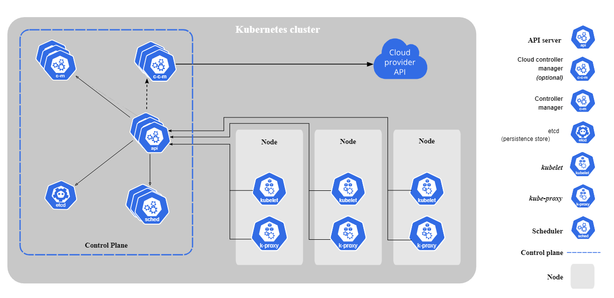

# explained

Kubernetes (K8s) is an open source system for automating the deployment, scaling, and management of containerized applications



## RKE2 (Ranchers Kubernetes Engine)

RKE2, also known as RKE Government, is Rancher's next-generation Kubernetes distribution. It is a fully conformant Kubernetes distribution that focuses on security and compliance within the U.S. Federal Government sector.

Installation:
```https://docs.rke2.io/install/quickstart```

Server Node

```sh
curl -sfL https://get.rke2.io | sh -
```

```sh
systemctl enable rke2-server.service
```

```sh
systemctl start rke2-server.service
```

follow Logs

```sh
journalctl -u rke2-server -f
```

Worker Node

```sh
curl -sfL https://get.rke2.io | INSTALL_RKE2_TYPE="agent" sh -
```

```sh
systemctl enable rke2-agent.service
```

configure the service

```sh
mkdir -p /etc/rancher/rke2/
vim /etc/rancher/rke2/config.yaml
```

Content for config.yaml

```sh
server: https://<server>:9345
token: <token from server node>
```

add Hostnames in etc/hosts

example:

```sh
write-kubeconfig-mode: "0644"
server: https://server01:9345
token: K100500924c8e0312900df84d6c7223bcf56b3ce39211625c32d6ddda633a56ddca::server:430a436436ddd8d49b70f05508543517
tls-san:
  - server01
  - 192.168.1.198
```
